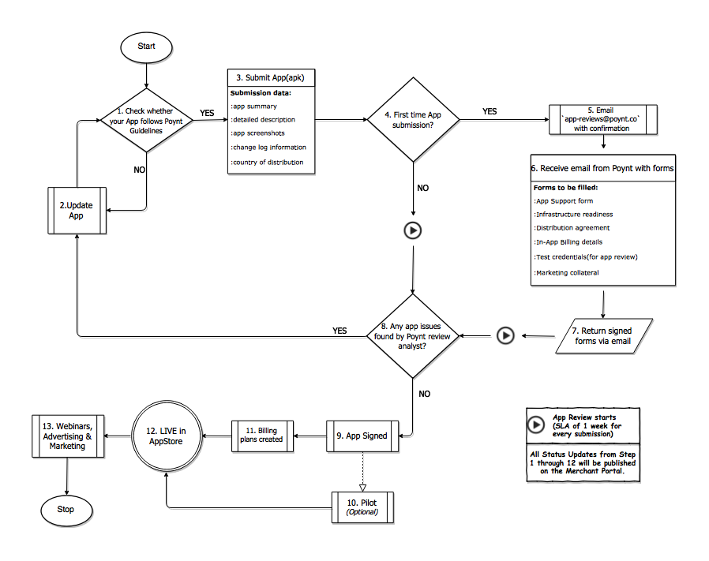

# App Review




## Pre-Requisites

* To maintain app adoption and continued merchant interest, the app review process considers the following factors:
* The app should be solving a specific merchant need or pain point or targetting a specific merchant vertical. The app should offer functionality that differentiates it from other apps available.
* The app developer is responsible for finding merchant/reseller who wants to use/distribute their app.

*  Developers sign up for a Developer account ([US](https://poynt.net/auth/signup/developer) \| [EU](https://eu.poynt.net/auth/signup/developer)).

*  Developers submit an app for review through the [Developer portal](https://poynt.net/terminalapps).

1. Developer verifies whether the app follows the general guidelines as described in the [Poynt App Development Guidelines](../appStore/app-development-guidelines.html).

2. Should any changes be required, developer updates their app.

3. When the app is created, Poynt generates 2048 bit RSA private key that the developer needs to download to securely communicate with their app. Poynt does not store the private key, so if the developer loses the key the will need to generate a new one on poynt.net.

The apk submission form requires the developer to provide a short application summary, detailed description, change log information, app screenshots and the country of distribution. This information will be used by the app review team and it will be displayed in the app marketplace (`Poynt Store`) once the app has been approved.

4. Upon submission, app status changes to `Submitted` in Poynt developer portal.
Once the app is submitted an automated ticket is generated in the Poynt ticketing system. App review team gets notified via email that the app has been submitted for review. You should receive an email confirmation as well with the next steps.

5. Access the following [Onboarding forms](https://poynt.net/mc/#/account/docs) within the developer portal:
* App support form
* Infrastructure readiness
* Distribution agreement
* In-App billing details(Plan names, descriptions, amounts etc, see step 11.)
* Test credentials(for app review)
* Marketing collateral(Images, write-ups etc for post go-live marketing)


6. Developer returns completed and signed forms to the Poynt app team by responding to the automated email generated after apk was submitted. If you did not receive that email you can send the documents directly to `app-reviews@poynt.co`.


7. At this point, the **Poynt App Review Team** is notified and an app review analyst reviews the submitted app.
During the review if any issues are found the app is rejected with the recommendation to update the app for further consideration. The app is placed back in the queue(Step 2) if rejected.
If the app passes all checks, the app moves to the next step in the process.

8. If the app passes all the necessary checks, it is signed.

9. After the app is signed, the app status is set to `In Pilot`. 
::: tip IMPORTANT
During this Pilot / Beta testing phase, the developer finds merchants with specific criteria to pilot their app (some are outlined in the Pre-Requisites section). This step allows the developer to run a pilot test with merchants on the Poynt app store before Go-Live.
Upon request Poynt will install the app on up to 5 devices for beta testing.
:::


11. Billing plans can be created under your app within the [App Dashboard](https://poynt.net/mc/#/developer/dashboard). Please follow the [**Billing Best practices**](../appStore/app-billing-best-practices.html) when requesting plans creation and through the app billing lifecycle. Plan information should be requested in the following format (Example below):

```
"name": "Basic plan",
"description": "Basic services plan with 30-day trial",
"country": "US",
"currency": "USD",
"value": 3999
"interval": "MONTH",
"scope": "BUSINESS",
"trialPeriodDays": 30
```

::: tip Note
"value" should be in cents <br>
"interval" can have any one of these values "DAY | WEEK | MONTH | YEAR" <br>
"scope" can have any one of these values "BUSINESS | STORE | DEVICE"
:::

The Poynt app team creates the plan and will respond with plan information. Sample plan information below:

```
{
    "description": "Basic services plan with 30-day trial",
    "scope": "BUSINESS",
    "createdAt": "2017-08-17T23:10:52.430Z",
    "updatedAt": "2017-08-17T23:10:52.430Z",
    "amounts": [
        {
            "country": "US",
            "currency": "USD",
            "value": 3999
        }
    ],
    "interval": "MONTH",
    "trialPeriodDays": 30,
    "amount": 3999,
    "planId": "d6d4894a-84dc-4f29-8d7d-d1e8f6b62b2d",
    "appId": "urn:aid:3f74d6f1-f489-45a0-ba54-3284dc6387bc",
    "status": "INACTIVE",
    "name": "Basic Plan"
}
```

 The developer uses the **planId** to integrate the billing flow in the app by invoking the billing fragment through the SDK. Please see [**Integration with Poynt Billing Services**](../appstore/integrating-with-billing.html) for integration details.

Once the app integration is complete, developer informs the Poynt app team. App team Activates (*"status": "ACTIVE"*) the plan. At this point the plan shows up in the Poynt App Store.

Additional plans can be requested in a similar way or all at once initially.

12. The app is set to **LIVE** by the app review analyst. The app shows up on the Poynt app store. Merchants can now find the app and Subscribe to the App's plans(as described in Step 11) by downloading and installing the app on their terminal.

13. Poynt developerm marketing team may reach out to the developer contact for details on setting up webinars, distribution strategy, etc.


## App Review SLA

Poynt reviews every apk submission of an app including updates and first-time submissions.
Developers need to have an app apk submitted to the [Developer portal](https://poynt.net/mc/#/developer/dashboard).
Please ensure the apk state is in **"Submitted"** state. Poynt app team does NOT review apps in **"Uploaded"** state.

### First-Time apk submission:
For first-time submission, the following App-Level Metadata is checked for validity:

App Information and assets:
* App Name
* App Description
* App Screenshots
* App Region
* App MCC Codes
* App Permissions (App requests Only for required implicit permissions)
* Support Email
* Website
* Privacy Policy web link
* Billing Plans
* App Tagline
* App Support Contact Info (Displayed under app in the app store)
* Featured Image

Additional details on [App Marketplace Design](https://d85ecz8votkqa.cloudfront.net/documents/ghost/App_Marketplace_Design.pdf)

### Subsequent apk submissions:

The following values are checked for validity with every Apk submission:


* Apk ChangeLog (Change details from previous submission)
* Icon Image (part of the apk submission specified within the Android manifest file)


Poynt App Review team expects the Developers to take care of Testing the following:


* Business logic
* App Functionality
* UI experience and language/localization checks


The scope of the Poynt app-review includes(but not limited to):

* Security Testing
* System Testing - Apps, Services and interoperability.
* Branding and any Poynt compliance issues

### New Apps:

With all the above requirements met, the first response from Poynt App review team will be **5 Business Days** from the date of App Submission through the Developer Portal.

The response could be any of the following:


* Apk Approval
* Apk Rejection (if the App does not comply with Poynt App Development guidelines)
* Email/Ticket response requesting additional details(such as Test credentials, clarifications, video walk-through or Images/snapshots)

Details on [Poynt App Development guidelines](app-development-guidelines.html)

The SLA will reset to **5 Business Days** for all follow-up requests and/or submissions.


### Existing Apps:

The first response from Poynt App review team will be **5 Business Days** from the date of updated App Submission through the Developer Portal.

The response could be any of the following:

* Apk Approval
* Apk Rejection (if the App does not comply with Poynt App Development guidelines)
* Email/Ticket response requesting additional details(such as Test credentials, clarifications, video walk-through or Images/snapshots)

Details on [Poynt App Development guidelines](/appStore/app-development-guidelines.html)

The SLA will reset to **5 Business Days** for all follow-up requests and/or submissions.


::: tip
For critical fixes with apk updates, you may escalate via [devsupport@poynt.com]()
:::