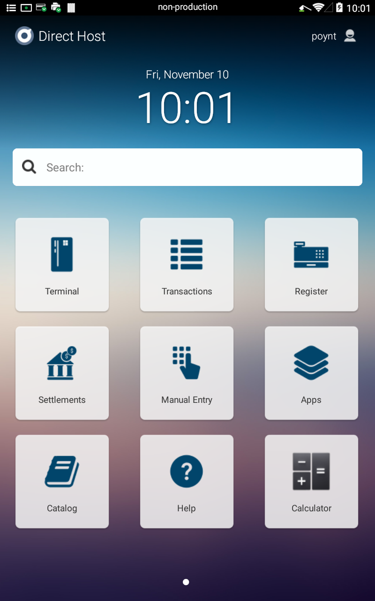

## Overview

PoyntOS is the world’s first payment terminal operating system, empowers developers with amazing tools to build applications for merchants. Small merchants today use a multitude of solutions running on various devices including outdated terminals, tablets, PCs, and phones. This not only creates a fragmented experience and security issues, but also adds up to additional costs in order to acquire the necessary hardware in addition to the apps.

Developing solutions for small merchants is hard. Developers are forced to integrate with proprietary systems and outdated technology that not only limits what you can do, but also restricts the reach to a limited number of merchants using that specific technology.

## Get Started

With PoyntOS SDK, you can now bring the capabilities of large merchants down to the small businesses countertop. These solutions can range from loyalty and CRM, to inventory and employee management.

PoyntOS consists of an Android-based application platform and RESTful Cloud APIs for integration over cloud. Depending on your app’s use case, you might need to integrate with one or both of them.

With PoyntOS all such solutions can be made available on the same payment terminal that every merchant uses on their counter. While we take care of the core payment processing for the merchant with the acquirer of their choice, you can focus on building the rest of the solutions that makes the merchant more productive and run a successful business, while providing an integrated and one-stop experience for them.

Unlike a traditional payment terminal which requires merchant or an ISV to build a payment application, Poynt comes with it’s own payment application called Poynt Services. Poynt Services abstracts a lot of low-level details required to communicate with the card reader and instead provides a higher level interface which applications (like Terminal, Register) can use to process transactions. Additionally, Poynt Services provides a payment UI (Payment Fragment) which provides the status of transaction processing and result. This architecture allows apps running on Poynt to be outside of PA-DSS scope and enables rapid integration.

SDK Apps running on the terminal use Poynt SDK which is freely available to developers and which can be downloaded automatically from Poynt’s Maven repository by Android Studio IDE. For detailed instructions please refer to [On-Terminal Apps](/guides/posapp/)

::: tip More Info
For a more detailed overview of PoyntOS architecture please refer to this [InfoQ article](http://bit.ly/2mC53vg)
:::

 ## Default Apps

Poynt Terminal comes with a list of default apps that can be configured by Poynt.

### Terminal

A simple calculator app that allows merchants to type in amount and accept payment.

### Transactions

Transactions list is actually part of the Terminal app but it has its own icon on the launcher screen. Transaction list displays a list of transactions (sales, refunds, voids, etc) and allows merchants to tap on any of the transactions to perform specific actions like refund, void, print receipt, etc.

### Register

A simple POS which pulls down the catalog of products from the Poynt cloud and allows merchants to scan items, apply discounts, save orders and other operations.

### Settlement

This app is used to adjust transactions, initiate settlement, view transaction and batch reports.

### Manual Entry

This app was created for merchant's convenience to quickly access the manual entry mode. Merchant can also initiate a manual entry transaction from the Payment Fragment UI. While this app is available on developer units, it may not be available for merchants on specific processors.

### Apps

Poynt Store where merchants can browse, purchase and download 3rd party applications and cancel subscriptions.

### Catalog

Merchants can create or update their product catalog by using Poynt HQ or using Catalog app.

### Help

This app has several video tutorials, support contain information, knowledgebase articles and a diagnostics app.

### calculator

A Simple calculator app.

