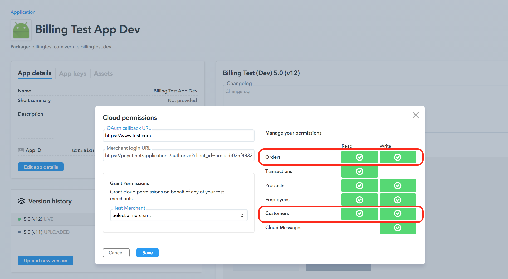
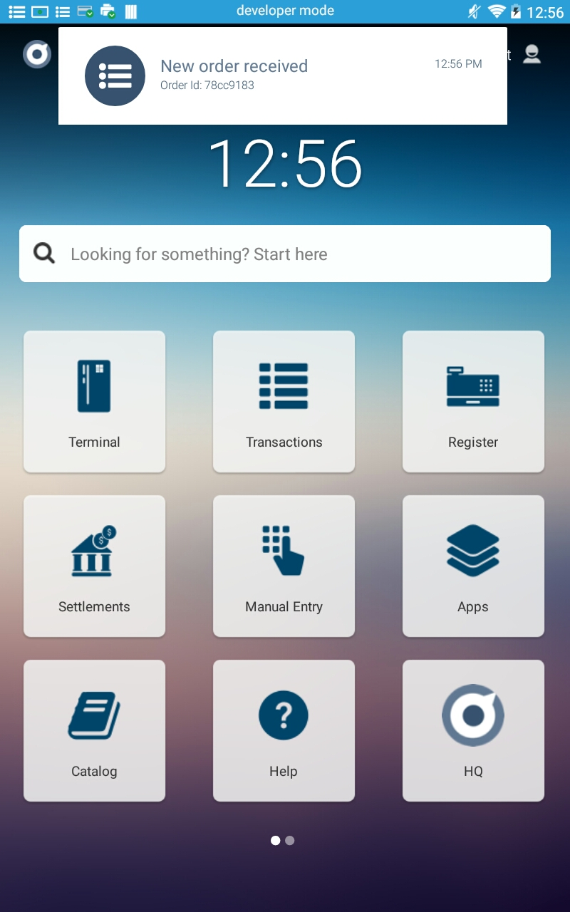
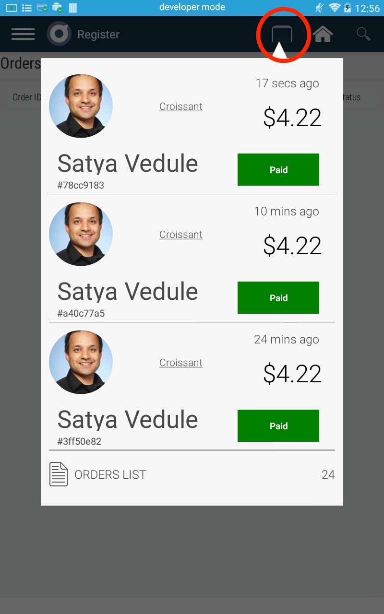
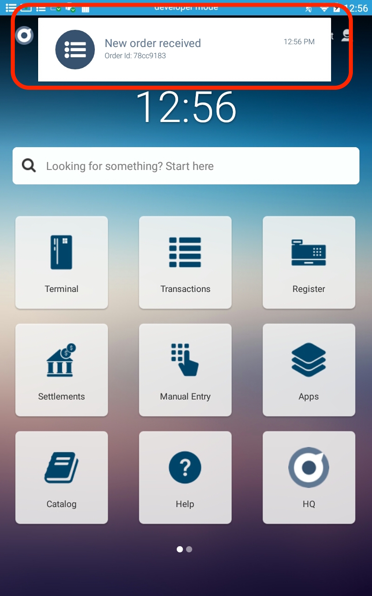

Order Ahead App can be built to work with Poynt in two ways broadly: 
 * Poynt Register App Integration
 * Native Order Ahead App Integration

## Poynt Register App Integration

An Order Ahead application can be built to work with the on-terminal [Poynt Register](https://poynt.zendesk.com/hc/en-us/articles/223240747-Register-App-Training-PDF-) application. Here are the steps:

#### 1. Merchant authorizes the App
Authorization flow is described under the [Poynt Cloud API](/cloudApps/integrating-with-poynt-cloud-apis.html) section. In this particular case, merchant authorizes access to 'Orders' and 'Customers' resources as shown below.

#### 2. Merchant completes the web-flow using the Merchant Login URL to grant permissions to the App
The web flow is further described under [Integrating with Cloud APIs](/cloudApps/integrating-with-poynt-cloud-apis.html).

#### 3. Create a Customer

Sample Request:
~~~bash
curl -X POST \
  https://services.poynt.net/businesses/{businessId}/customers \
  -H 'Authorization: Bearer <access-token>' \
  -H 'Cache-Control: no-cache' \
  -H 'Content-Type: application/json' \
  -H 'api-version: 1.2' \
  -d '{
            "emails": {
                "PERSONAL": {
                "emailAddress": "satya+test@poynt.com"
                }
            },
            "firstName": "Satya",
            "lastName": "Vedule",
            "attributes": {"imageUrl": "https://bit.ly/2IjahBz"}
        }'
~~~

Response:
~~~json
{  
   "businessPreferences":{  

   },
   "id":45494460,
   "emails":{  
      "PERSONAL":{  
         "primary":False,
         "createdAt":"2018-06-20T20:58:15Z",
         "updatedAt":"2018-06-20T20:58:15Z",
         "status":"ADDED",
         "type":"PERSONAL",
         "id":939970,
         "emailAddress":"satya+test1@poynt.com"
      }
   },
   "attributes":{  
      "imageUrl":"https://bit.ly/2IjahBz"
   },
   "firstName":"Satya",
   "lastName":"Vedule",
   "businessId":"{businessId}"
}
~~~
The **`id`** value (in this case `45494460`) corresponds to the `customerId`. This value can be passed to the Order for displaying the customer details. 

#### 4. Create an Order

Sample Request:
~~~json
curl -X POST \
  https://services.poynt.net/businesses/{businessId}/orders \
  -H 'Authorization: Bearer <access-token>' \
  -H 'Cache-Control: no-cache' \
  -H 'Content-Type: application/json' \
  -H 'api-version: 1.2' \
  -d '{
   "items":[
      {
         "status":"ORDERED",
         "fulfillmentInstruction":"PICKUP_INSTORE",
         "clientNotes":"to be picked from store# 121",
         "code":"Cr",
         "name":"Croissant",
         "unitOfMeasure":"EACH",
         "popular":true,
         "unitPrice":195,
         "tax":32,
         "quantity":2.0
      }
   ],
   "amounts": {
      "taxTotal":32,
      "discountTotal":0,
      "subTotal":390,
      "currency":"USD"
   },
   "context": {
      "source":"WEB",
      "transactionInstruction":"EXTERNALLY_PROCESSED",
      "businessId":"{businessId}", 			                               // businessId of the merchant
      "storeId":"{storeId}",				                               // storeId of the business
      "storeDeviceId":"{appId}"	                                                       // AppId of the developer app
   },
   "customerUserId": 45494460,			                                   //customerId from the Create Customer call.
   "statuses": {
      "status":"OPENED"
   }
}'
~~~

Order object Request 
Response:

~~~json
{
    "createdAt": "2018-06-22T19:45:41Z",
    "updatedAt": "2018-06-22T19:45:41Z",
    "context": {
        "employeeUserId": 0,
        "storeDeviceId": "{appId}",
        "transactionInstruction": "EXTERNALLY_PROCESSED",
        "source": "WEB",
        "businessId": "{businessId}",
        "storeId": "{storeId}"
    },
    "items": [
        {
            "createdAt": "2018-06-22T19:45:41Z",
            "updatedAt": "2018-06-22T19:45:41Z",
            "quantity": 2,
            "fulfillmentInstruction": "PICKUP_INSTORE",
            "id": 1,
            "unitPrice": 195,
            "discount": 0,
            "fee": 0,
            "tax": 32,
            "status": "FULFILLED",
            "name": "Croissant",
            "clientNotes": "to be picked from store# 121",
            "unitOfMeasure": "EACH"
        }
    ],
    "customerUserId": 45494460,
    "amounts": {
        "subTotal": 390,
        "discountTotal": 0,
        "taxTotal": 32,
        "netTotal": 422,
        "currency": "USD"
    },
    "statuses": {
        "fulfillmentStatus": "FULFILLED",
        "status": "OPENED",
        "transactionStatusSummary": "EXTERNALLY_PROCESSED"
    },
    "id": "xxxxxxx"
}
~~~

The Order has been successfully created.
A Poynt Cloud Message is sent to the terminal for the newly created order.
  

Order can be viewed from Order Inbox in the Register app.
  

 
## Native Order Ahead App Integration

A Native Order Ahead app can be built to work with Poynt. Here are the steps involved:

#### 1. Implicit Authorization

Following permissions should be included in the app Android manifest: 

**Order Service:** `poynt.permission.ORDER_SERVICE`

**Customer Service:** `poynt.permission.CUSTOMER_SERVICE`

When a merchant subscribes to the App, these permissions are implicitly granted to the app.

#### 2. Create Customer and Create Order

Create a Customer followed by an Order as described in the previous article of Order ahead integration using Register app(Steps 3 and 4).

#### 2. Register to listen to order details intent in your app's activity

When the user taps on the Order Notification on the terminal, the `Intents.ACTION_GO_TO_ORDER_DETAILS` can be handled to create a custom Order details view in your app.
 

<!-- feedback widget -->

