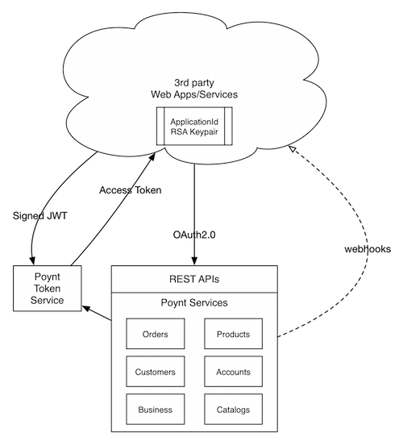

  # Building an On-Cloud App
  [[toc]]
  ## Overview
  
  All Poynt managed services and data are accessible through RESTful APIs in the cloud. These APIs can be used to build applications in the cloud that can sync or process data, create and manage various resources (orders, customers, products, etc.) on-behalf of the merchant, build mobile applications for consumers that connect back to the merchant’s Poynt Terminal, and many more.
 
 
 At a high level consuming Poynt APIs on behalf of a merchant involves the following steps:

1. Register an Application with the resources your application would like to access on behalf of the merchant and obtain API Credentials
2. Obtain Access Token from the Poynt OAuth2.0 end point
3. Make authenticated API calls passing the Access Token in the Authorization header.

## Integrating with Poynt Cloud APIs

Poynt Cloud APIs can be used to build applications in the cloud that can sync or process data, create and manage various resources (orders, customers, products, etc.) on-behalf of the merchant, build mobile applications for consumers that connect back to the merchant’s Poynt Terminal, and many more.

All Poynt APIs are built with commonly used RESTful design patterns in the industry. All APIs using the standard OAuth2.0 authentication & authorization framework and uses Json Web Tokens (aka JWTs) as bearer tokens.

:::tip Note
If you already have an on-terminal app you can use it's appId to make cloud API calls without additional authorization from the merchant as long as the app is installed on their terminal.
:::

### Getting Started

1. Sign-up on [Poynt Developer Portal](https://poynt.net/auth/signup/developer)
2. After you’re registered, you will see Poynt Developer dashboard.
  - All developers by default are assigned their default developer organization so they can invite other teammates to join and access the same applications. You can try this out later after setting up your device.
1. On the dashboard, click on “MERCHANTS” tab. To create a test merchant for your development activity, enter the Merchant Name and Bank and click “Submit”.
2. Once a test merchant is created, go to “DEVELOPMENT” -> click on “Create an app”.
3. Enter the App name and click on “Submit” button.
4. Click on “Download keypair” to save your newly created application credentials and click on “Go to app”.
:::warning Warning
Our private key cannot be recovered, so please save them it a safe location. If you lose your private key you will be able to reset the public/private keypair for your appId
:::

