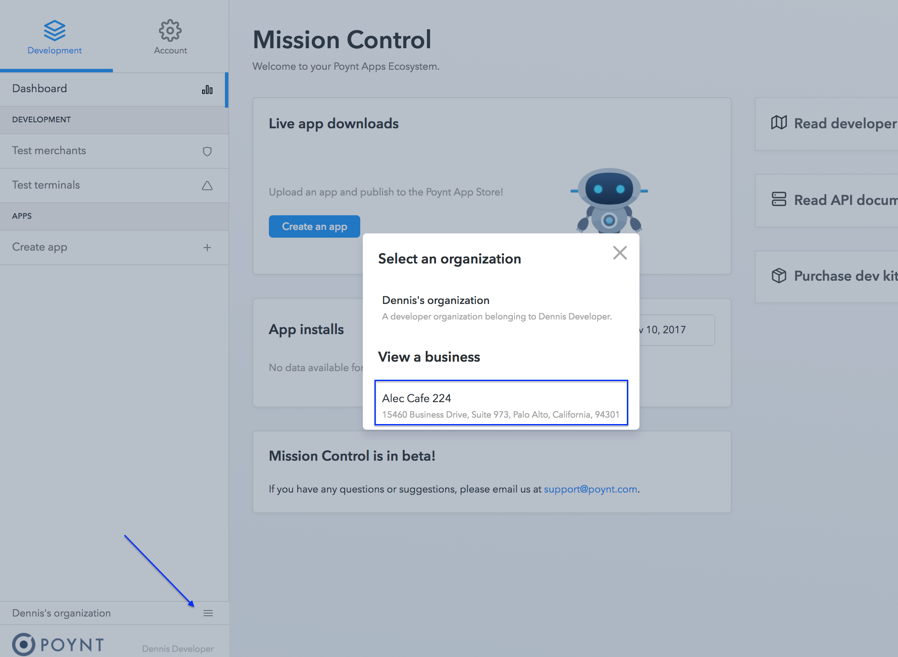
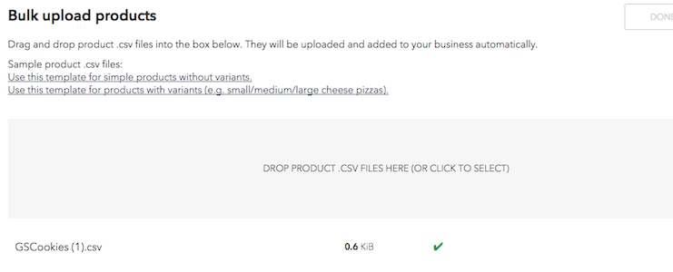
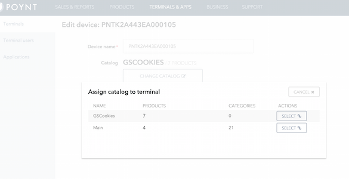
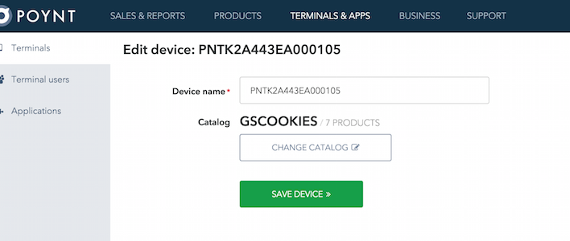

Assigning a product catalog to a Poynt Register can be done through https://poynt.net
portal. Usually this involves creating a catalog (either through a csv file upload or 
manually entry), and assigning it to a terminal registered with your business.

### Pre-Reqs

1. Register as a Poynt Developer
2. Setup PoyntOS on a Poynt Terminal or an Android device/emulator
3. Activate Poynt Terminal through the 'SetUp Wizard'

### Create a Catalog (using bulk upload method)

1. Login to [Developer Portal](https://poynt.net) with your developer account

2. Select the test business that you want to add the Catalog for. 
 

3. Click on `PRODUCTS` in the top navigation bar  

4. Click on `BULK UPLOAD` button  

5. Download the sample csv file (either the simple catalog or the one with variants),
update it to with your products and categories
  * NOTE: You must maintain the format of each line to match the header inside the file
  * Here is a sample with famous Girl Scout Cookies: [GSCookies.csv](../assets/GSCookies.csv) 

6. Drag and drop your catalog csv file to begin your catalog upload
  * Wait until you see the upload as complete (green check mark)  

7. Click on `PRODUCTS` in the left navigation to confirm the products you've uploaded.

### Assign Catalog to Register

1. Click on `TERMINALS & APPS` in the top navigation bar  

2. You should see the terminal that you've activated (either on Poynt Terminal or an Android device/emulator)  

3. Click on `Edit` under actions to open Terminal info page.

4. Click on `Select Catalog` to open Catalog selection dialog  

5. Once a catalog is selected, it will be assigned to the terminal.  

6. At this point your terminal is configured with your catalog, and the Poynt Register
would load the Catalog when it's started next time.

<!-- feedback widget -->

